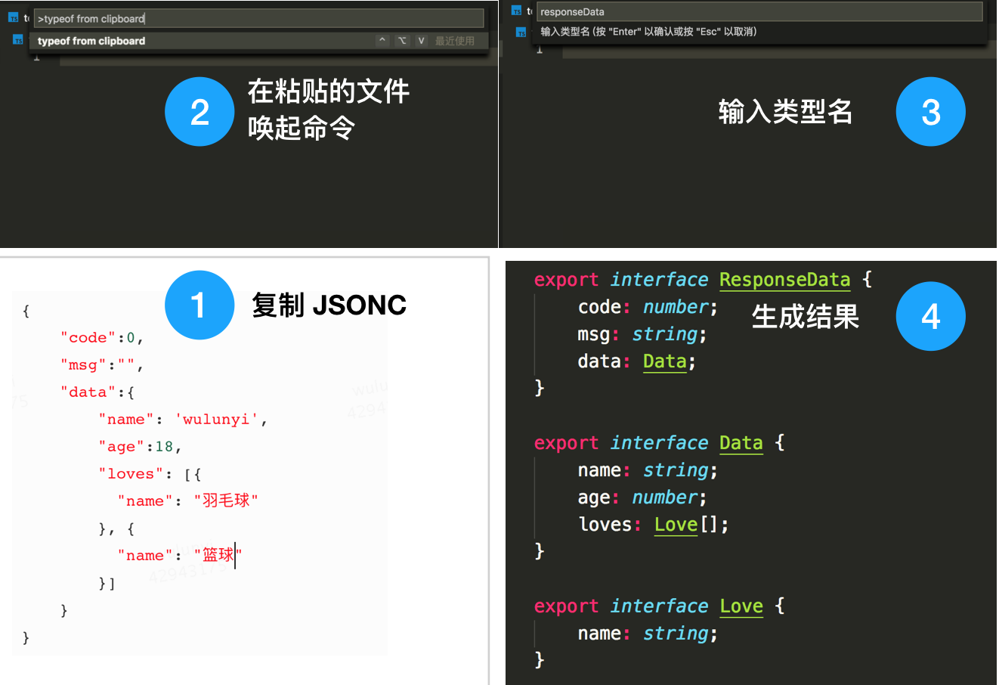
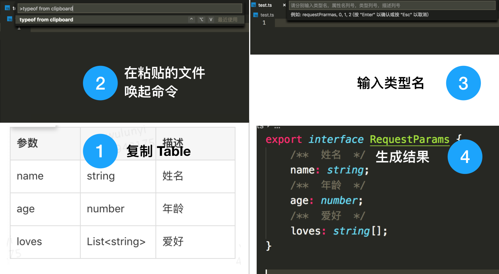

# typeof-jsonc

将剪切板中的 jsonc 文本或者 table html 转换为 TypeScript 类型

## commands

命令： typeof from clipboard

typeof-jsonc 转换

typeof-table 转换

## 快捷键

`ctrl+alt+V`

复制完毕后进入粘贴的位置执行快捷键，然后扩展应用会自动识别是否是转换 jsonc 和 table 

## 注意事项

+ 请复制 jsonc 文本或表格后在需要粘贴位置执行命令或者运行快捷键
